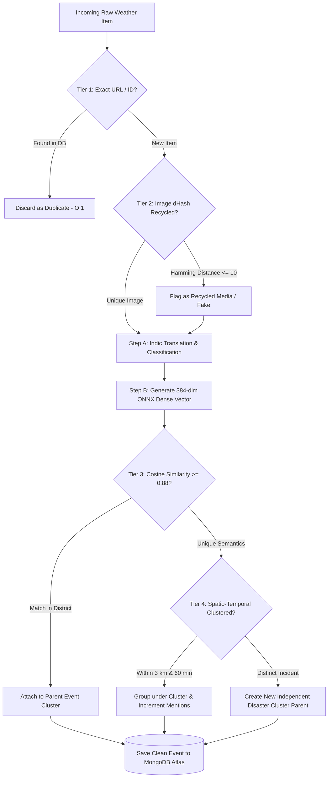

# 🌦️ MausamVani — National Weather Big Data Analytics Platform

<div align="center">


**An AI-driven, enterprise-grade meteorological big data intelligence platform for India — fusing real-time multi-source data ingestion, Indic multilingual neural translation, 4-tier deduplication & clustering, dynamic district-level disaster warning percentages (0–100%), cryptographic officer RBAC authentication, and interactive GIS mapping.**

[System Architecture](#-system-architecture) • [Microservices Breakdown](#-microservices-breakdown) • [4-Tier Deduplication](#-4-tier-deduplication--clustering-engine) • [Warning Severity Formula](#-dynamic-warning-severity-percentage-engine) • [API Reference](#-complete-rest-api-documentation) • [Installation & Setup](#-step-by-step-installation--quick-start) • [Live Demo Guide](#-live-testing--demonstration-guide)

</div>

---

## 📌 Executive Summary & Problem Statement

India regularly faces high-impact meteorological events including monsoon cloudbursts, severe urban waterlogging, cyclones, flash floods, extreme heatwaves, and landslides. During these critical events, millions of hyper-local ground observations emerge across:
- **Social Media Streams** (`#IMD`, `#MumbaiRains`, `#DelhiRain`, `#CycloneAlert`, `#LucknowRains`, `#Floods`)
- **Regional Vernacular Press** (Hindi, Marathi, Tamil, Bengali, Telugu, Gujarati, Malayalam, Kannada, Punjabi)
- **Official Meteorological Gateways** (India Meteorological Department - IMD bulletins, nowcasts, and AWS telemetry)
- **On-Ground Citizen Observers** (Geo-tagged field photographs and real-time distress reports)

### 🎯 Key Challenges Solved:
1. **Information Silos**: Unifying official government forecasts with unorganized social and news data.
2. **Language Barriers**: Real-time translation of 22+ Scheduled Indian languages into standardized English for emergency responders.
3. **Data Noise & Fake Media**: Eliminating spam, duplicate reports, and recycled photos from previous years using perceptual hashing and semantic vectors.
4. **Quantifiable Disaster Risk**: Generating an objective, formula-driven $0\% - 100\%$ Warning Severity Percentage for every Indian district.
5. **Secure Verification Pipeline**: Providing National Disaster Management Authority (NDMA) and IMD officers with a cryptographic JWT-gated control room to triage reports and push official advisories.

---

## 🏗️ System Architecture

MausamVani is architected as three decoupled, highly scalable microservices interacting with a unified **MongoDB Atlas Document & Vector Database**:

```
 ┌─────────────────────────────────────────────────────────────────────────────────────────────────┐
 │ SERVICE 1: INGESTION & AI PROCESSING PIPELINE (Port 8000 / Scheduled Cron / CLI)                 │
 │ • Automated Ingestion Cron (.github/workflows/ingest.yml & local runner every 5-15 mins)         │
 │ • IMD Ingestion Engine: Official IMD API Gateway (api.imd.gov.in) + Real-time Press Bulletins  │
 │ • News Ingestion Engine: Strict Meteorological RSS Scrapers (Google News EN/HI, Skymet, AIR)   │
 │ • Social Media Ingestion: Twitter/X API v2 + Reddit India (r/lucknow, r/mumbai) + Mastodon     │
 │ • Indic Translation: OpenRouter AI / LLMs + High-Speed Local Heuristic Indic Glossary           │
 │ • 4-Tier Deduplication: Exact URL -> Media dHash (64-bit) -> Vector Cosine -> Spatio-Temporal  │
 │ • Vector Embeddings: In-Process HuggingFace ONNX Pipeline (Xenova/bge-small-en-v1.5, 384-dim)   │
 └────────────────────────────────────────────────┬────────────────────────────────────────────────┘
                                                  │
                                                  ▼
 ┌─────────────────────────────────────────────────────────────────────────────────────────────────┐
 │ DATABASE: MONGODB ATLAS (Unified Document, Geospatial & Dense Vector Store)                     │
 │ • Collection `weather_events`: Clean weather documents, GeoJSON coordinates, 384-dim vectors     │
 │ • Collection `imd_alerts`: Official IMD bulletins, color codes (RED/ORANGE/YELLOW), valid windows│
 │ • Vector Search Index (`vector_index`): Cosine similarity search on `embedding` field           │
 │ • Geospatial 2dsphere Index: Radius and bounding box spatial queries on `location.coordinates`   │
 └────────────────────────────────────────────────▲────────────────────────────────────────────────┘
                                                  │
                                                  ▼
 ┌─────────────────────────────────────────────────────────────────────────────────────────────────┐
 │ SERVICE 2: EXPRESS BACKEND API GATEWAY (Port 5000)                                              │
 │ • Mathematical Disaster Warning Percentage Engine (0% - 100% dynamic risk index)               │
 │ • Area Telemetry Controller: Geospatial $near 50km radius search + District/State query fallback│
 │ • Semantic Vector Search: MongoDB Atlas $vectorSearch + Multi-field Regex Search Fallback       │
 │ • Citizen Intake Controller: Multipart image upload (Multer) + Auto-embedding generation        │
 │ • Security & RBAC: Cryptographic JWT authentication for NDMA/IMD Chief Officers                │
 │ • Administrative Triage: Status moderation (VERIFIED / HOAX / REJECTED) with audit trail        │
 └────────────────────────────────────────────────▲────────────────────────────────────────────────┘
                                                  │
                                                  ▼
 ┌─────────────────────────────────────────────────────────────────────────────────────────────────┐
 │ SERVICE 3: NEXT.JS 16 GIS FRONTEND DASHBOARD (Port 3000)                                        │
 │ • High-Contrast Government of India (GoI / MoES) Institutional Theme (Navy #002b5b / Slate-950)  │
 │ • Interactive GIS Map: High-res open ESRI World Street GIS tiles, flyTo animations, radar pins   │
 │ • Multi-Tier Geolocation Engine: Browser GPS -> Instant IP Geolocation (ipwho.is) -> Reverse   │
 │ • Live Dynamic Warning Gauge: SVG Circular gauge with animated thresholds (0-100%)              │
 │ • Citizen Observation Intake: Geo-tagged photo submission form with instant coordinate lock     │
 │ • Officer Triage Room: Protected dashboard for reviewing, verifying, and flagging reports      │
 │ • National Disaster Analytics: Multi-dimensional charts on event categories, states & clusters │
 └─────────────────────────────────────────────────────────────────────────────────────────────────┘
```

---

## 🔬 Microservices Breakdown

### 1. Ingestion Pipeline & AI Processing (`backend/ingestionPipeline`)
- **Port**: `8000` (Optional webhook server) | **CLI Tool**: `node cli.js` | **Cron**: `.github/workflows/ingest.yml`
- **Official IMD Gateway (`imdScraper.js`)**:
  - Connects to official IMD API Gateway (`https://api.imd.gov.in`) endpoints:
    - `/api/v1/districtwarning`: 5-Day District Warning Codes (1–17) and Color Codes (1–4).
    - `/api/v1/districtnowcast`: 3-Hour Nowcast Codes and Wind/Thunderstorm severity.
    - `/api/v1/subdivisionwarning`: Subdivisional Meteorological Bulletins.
  - Multi-tier fallback resilience: Real-time IMD Press RSS feeds + Pre-configured ground-truth emergency bulletins.
- **Strict Meteorological News Scraper (`newsRssScraper.js`)**:
  - Monitors curated national and regional meteorological feeds (Google News India, Google News Hindi, UP/Lucknow Weather, and National Disaster bulletins).
  - Enforces a **Strict Meteorological Keyword Gate** (`WEATHER_KEYWORDS` regex dictionary across English and Hindi), automatically discarding political, entertainment, crime, and non-weather articles.
- **Social Media Crawler (`twitterScraper.js`)**:
  - Queries official Twitter/X Developer API v2 recent search endpoint (`api.twitter.com/2/tweets/search/recent`).
  - Fallback to real-time Reddit communities (`r/lucknow`, `r/uttarpradesh`, `r/mumbai`, `r/delhi`, `r/bangalore`, `r/chennai`, `r/hyderabad`, `r/kolkata`, `r/kerala`, `r/india`) and Mastodon Fediverse disaster hashtags (`#lucknowrains`, `#mumbairains`, `#weather`, `#monsoon`, `#imd`).
- **Multilingual Indic Neural Translation (`indicTranslator.js`)**:
  - Automatically identifies Indic scripts across 8 major linguistic branches: Hindi (`[\u0900-\u097F]`), Bengali (`[\u0980-\u09FF]`), Tamil (`[\u0B80-\u0BFF]`), Telugu (`[\u0C00-\u0C7F]`), Gujarati (`[\u0A80-\u0AFF]`), Malayalam (`[\u0D00-\u0D7F]`), Kannada (`[\u0C80-\u0CFF]`), Punjabi (`[\u0A00-\u0A7F]`).
  - Translates into standardized English via OpenRouter AI / LLMs (`google/gemini-2.0-flash-lite-001`) with a 2.5s timeout.
  - Features an instant, deterministic Indic weather glossary fallback for zero-latency offline operation.
- **Weather Event Classification & Severity Engine (`classifier.js`)**:
  - Classifies events into 8 standard disaster categories: `RAINFALL`, `FLOODING`, `THUNDERSTORM`, `CYCLONE`, `HEATWAVE`, `COLDWAVE`, `FOG`, `LANDSLIDE`.
  - Assesses severity level (`LOW`, `MODERATE`, `HIGH`, `CRITICAL`) and computes confidence and trust scores based on author verification, image attachments, and IMD corroboration.
- **On-Device ONNX Vector Embeddings (`extractor.js`)**:
  - Uses `@huggingface/transformers` to run the `Xenova/bge-small-en-v1.5` model locally in Node.js.
  - Converts weather texts into dense 384-dimensional normalized float vectors with zero paid third-party embedding API costs.

---

### 2. Express Backend API Gateway (`backend/expressServer`)
- **Port**: `5000` | **Runtime**: Node.js / Express 5
- **Geospatial & Area Telemetry Engine (`areaService.js`)**:
  - Executes MongoDB `$near` geospatial queries with a 50 km spherical radius around incoming user coordinates.
  - Automatically falls back to hierarchical District $\to$ City $\to$ State regex queries to guarantee zero empty responses.
  - Corroborates active district records against the latest IMD warning bulletins.
- **Dynamic Warning Severity Engine (`warningCalculator.js`)**:
  - Calculates real-time disaster percentages from 0% to 100% using a multi-factor formula.
- **Semantic Vector Search Engine (`vectorSearchService.js`)**:
  - Vectorizes incoming search queries in real-time and runs Atlas `$vectorSearch` cosine aggregation.
  - Provides a resilient multi-field regex fallback covering translated text, original Indic text, landmarks, cities, districts, and states.
- **Administrative Security & RBAC (`authMiddleware.js`)**:
  - Cryptographically verifies JSON Web Tokens (JWT) signed with `HS256`.
  - Protects moderation endpoints (`/api/admin/verify/:id`) and logs officer signatures for full accountability.
- **Citizen Multipart File Ingestion (`citizenController.js`)**:
  - Utilizes Multer for multipart disk storage of citizen field photographs.
  - Automatically computes text embeddings and attaches GeoJSON point coordinates for immediate spatial querying.

---

### 3. Next.js 16 GIS Frontend (`frontend`)
- **Port**: `3000` | **Framework**: Next.js 16 (App Router) + React 19 + Turbopack
- **Aesthetic & Design System**:
  - Strict compliance with official Government of India web guidelines (Ministry of Earth Sciences palette).
  - Deep Navy (`#002b5b`), crisp white cards, bold high-contrast Slate-950 typography, sharp 2px slate borders, and zero childish emojis.
- **GIS Interactive Map Engine (`MapView.js`)**:
  - Employs open, watermark-free, high-resolution **ESRI World Street Map GIS tiles** (`server.arcgisonline.com/ArcGIS/rest/services/World_Street_Map/MapServer/tile/{z}/{y}/{x}`).
  - Smooth animated camera movements (`map.flyTo`) when switching territories.
  - Renders a pulsing blue radar target pin for user location, color-coded severity markers (Red/Orange/Yellow/Blue), and interactive popup dossiers.
- **Multi-Tier Geolocation Engine (`locationService.js`)**:
  - Resolves client location through a multi-tier fallback architecture:
    1. **Browser Geolocation**: Fast low-accuracy WiFi/GPS capture.
    2. **Instant IP Geolocation (`ipwho.is` / `ipapi.co`)**: Immediate fallback if GPS hardware is missing on desktops or permission is blocked.
    3. **Reverse Geocoding (OpenStreetMap Nominatim + BigDataCloud API)**: Automatically converts coordinates into Landmark, City, District, State, and Latitude/Longitude.
- **Core Views**:
  - **National Weather Explorer (`/`)**: Territory selector with state/district dropdowns, quick hotspots (Lucknow, Mumbai, Delhi, Chennai, Bengaluru, Wayanad, Golaghat), warning percentage gauge, IMD alert banner, GIS map, and photo evidence gallery.
  - **Citizen Observation Intake (`/report`)**: Mobile-first field reporting form with 1-click GPS auto-capture, category selection, photo upload, and instant receipt generation.
  - **Officer Control Room (`/admin`)**: Institutional login gatekeeper with 1-click demo credentials, live triage queue, and report audit controls.
  - **National Disaster Analytics (`/analytics`)**: Macro-level analytical charts on state disaster distributions, category breakdowns, and deduplication efficiencies.

---

## 🛡️ 4-Tier Deduplication & Clustering Engine

During catastrophic weather events, thousands of redundant social posts and news articles are broadcast. MausamVani implements a multi-stage filtering pipeline to ensure only clean, unique, and actionable intelligence reaches emergency responders:



### Tier Breakdown:
1. **Tier 1 (Exact URL / Source ID)**:
   - Evaluates URL hashes in $O(1)$ time against indexed MongoDB records before allocating AI compute resources.
2. **Tier 2 (Perceptual Difference Hash — `dHash`)**:
   - Computes a 64-bit gradient difference hash of attached media images. Compares against past disaster photos using bitwise Hamming distance ($\le 10$) to detect and flag recycled images from previous flood years.
3. **Tier 3 (Semantic Vector Cosine Similarity $\ge 0.88$)**:
   - Measures semantic alignment using 384-dimensional cosine similarity against recent posts in the same district. Paraphrased reports describing the same event are linked to the existing parent report.
4. **Tier 4 (Spatio-Temporal Co-occurrence Clustering)**:
   - Uses the Haversine distance formula to identify incidents of the same category occurring within a **3 km spatial radius** and **60-minute time window**. Automatically groups them under a single cluster and increments the `mentions_count`.

---

## ⚠️ Dynamic Warning Severity Percentage Engine

MausamVani replaces vague qualitative descriptions with a quantifiable, objective **Disaster Warning Percentage ($W \in [0\%, 100\%]$)** calculated in real-time for any Indian district:

### Mathematical Formulation:

$$W = \min\Big(100, \; 0.40 \cdot S_{\text{imd}} + 0.25 \cdot S_{\text{vel}} + 0.15 \cdot S_{\text{key}} + 0.20 \cdot S_{\text{vis}}\Big)$$

### Metric Weights & Definitions:

| Component | Weight | Mathematical Input & Range | Description |
| :--- | :---: | :--- | :--- |
| **Official IMD Bulletin ($S_{\text{imd}}$)** | **40%** | $\text{Red}=100, \text{Orange}=75, \text{Yellow}=40, \text{Green}=0$ | Ground-truth meteorological alert level issued by IMD for the district. |
| **Social Report Velocity ($S_{\text{vel}}$)** | **25%** | $S_{\text{vel}} = \min(100, \; \text{ReportCount} \times 12.5)$ | Surge velocity of citizen and social media reports in the last 2 hours. |
| **Keyword Disaster Score ($S_{\text{key}}$)** | **15%** | $S_{\text{key}} = \min(100, \; \sum \text{SeverityScores} / N)$ | Natural language severity extracted from critical disaster terminology. |
| **Visual Confirmation ($S_{\text{vis}}$)** | **20%** | $S_{\text{vis}} = \min(100, \; \text{VerifiedPhotoCount} \times 25)$ | Confirmed photographic evidence uploaded from the field. |

### Color-Coded Risk Tiers:

| Warning Percentage ($W$) | Risk Tier | Color Code | Hex Code | Operational Action |
| :---: | :---: | :---: | :---: | :--- |
| **0% – 29%** | **LOW / NORMAL** | 🟢 Green | `#10b981` | Standard routine monitoring. No immediate threat. |
| **30% – 59%** | **MODERATE** | 🟡 Yellow | `#eab308` | Localized rain/traffic delays. Stay updated with bulletins. |
| **60% – 79%** | **HIGH RISK** | 🟠 Orange | `#f97316` | Severe waterlogging / squalls. Prepare emergency response teams. |
| **80% – 100%** | **CRITICAL DISASTER** | 🔴 Red | `#dc2626` | Life-threatening disaster / flash floods. Evacuation and rescue ops. |

---

## 📡 Complete REST API Documentation

Base URL: `http://localhost:5000`

### 1. Weather & Area Intelligence

#### `GET /api/weather/area`
Fetches comprehensive meteorological intelligence for a specific district, city, or coordinate point.
- **Query Parameters**:
  - `state` *(string)*: State name (e.g. `Uttar Pradesh`)
  - `district` *(string)*: District name (e.g. `Lucknow`)
  - `city` *(string)*: City name (e.g. `Lucknow`)
  - `lat` *(number)*: Latitude (e.g. `26.8467`)
  - `lng` *(number)*: Longitude (e.g. `80.9462`)
  - `radiusKm` *(number, default: 50)*: Search radius in kilometers.
- **Sample Response (`200 OK`)**:
```json
{
  "area": {
    "state": "Uttar Pradesh",
    "district": "Lucknow",
    "city": "Lucknow",
    "lat": 26.8467,
    "lng": 80.9462
  },
  "warning": {
    "warning_percentage": 78.5,
    "warning_level": "HIGH_RISK",
    "color_code": "ORANGE",
    "advisory": "Orange Alert active. Severe waterlogging reported in low-lying corridors.",
    "metrics": {
      "imd_score": 75,
      "velocity_score": 85,
      "keyword_score": 70,
      "visual_score": 80,
      "total_reports_count": 14,
      "photo_evidence_count": 5
    }
  },
  "imd_alert": {
    "bulletin_code": "IMD-NOWCAST-UP-2026",
    "state": "Uttar Pradesh",
    "district": "Lucknow",
    "city": "Lucknow",
    "color_code": "ORANGE",
    "headline": "Orange Alert: Moderate to severe thunderstorms with gusty winds (40-60 kmph) and lightning over Lucknow and Central UP",
    "instructions": "Stay indoors during lightning activity. Avoid taking shelter under isolated trees.",
    "valid_to": "2026-09-14T20:00:00.000Z"
  },
  "events_count": 13,
  "events": [...],
  "photo_gallery": [...]
}
```

---

#### `GET /api/weather/search`
Performs vector semantic search and resilient multi-field keyword search across all ingested weather reports.
- **Query Parameters**:
  - `q` *(string, required)*: Search query (e.g. `waterlogging near Dadar underpass` or `lucknow thunderstorm`)
  - `limit` *(number, default: 20)*: Maximum number of results.
- **Sample Response (`200 OK`)**:
```json
[
  {
    "_id": "66e4a2c9f1b2c3d4e5f6a7b8",
    "cluster_id": "cluster_lucknow_1726321200000",
    "event_category": "RAINFALL",
    "severity": "MODERATE",
    "translated_text": "Heavy rainfall causes water stagnation near Hazratganj crossing.",
    "original_text": "हजरतगंज चौराहे के पास भारी बारिश से जलभराव की स्थिति।",
    "original_language": "hi",
    "location": {
      "city": "Lucknow",
      "district": "Lucknow",
      "state": "Uttar Pradesh",
      "coordinates": [80.9462, 26.8467]
    },
    "verification_status": "VERIFIED",
    "trust_score": 85,
    "timestamps": {
      "event_time": "2026-09-14T12:00:00.000Z"
    }
  }
]
```

---

#### `GET /api/weather/events`
Returns filtered weather event records based on multi-faceted query constraints.
- **Query Parameters**:
  - `state` *(string)*: State filter (e.g. `Maharashtra`)
  - `category` *(string)*: Category filter (`RAINFALL`, `FLOODING`, `THUNDERSTORM`, `CYCLONE`, `HEATWAVE`, `FOG`, `LANDSLIDE`)
  - `verification` *(string)*: Status filter (`VERIFIED`, `UNVERIFIED`, `HOAX`)
  - `startDate` / `endDate` *(ISO date string)*
  - `limit` *(number, default: 50)*

---

### 2. Citizen Crowdsourced Reporting

#### `POST /api/citizen/report`
Accepts field weather observations with optional photographic evidence.
- **Content-Type**: `multipart/form-data`
- **Body Fields**:
  - `description` *(string, required)*: Text description of the observation.
  - `event_category` *(string)*: Category (`FLOODING`, `RAINFALL`, `THUNDERSTORM`, etc.)
  - `severity` *(string)*: Severity (`LOW`, `MODERATE`, `HIGH`, `CRITICAL`)
  - `landmark` *(string)*: Locality or street landmark.
  - `city` *(string, required)*: City name.
  - `district` *(string, required)*: District name.
  - `state` *(string, required)*: State name.
  - `latitude` *(number, required)*: Geotagged latitude.
  - `longitude` *(number, required)*: Geotagged longitude.
  - `image` *(file, optional)*: Attached photo evidence (JPEG, PNG, WebP).
- **Sample Response (`201 Created`)**:
```json
{
  "success": true,
  "message": "Citizen report recorded successfully.",
  "report": {
    "_id": "66e4b5a1f1b2c3d4e5f6a7c9",
    "cluster_id": "citizen_1726321500000",
    "source_type": "citizen",
    "original_text": "2 feet water stagnation at Gomti Nagar underpass. Vehicles halted.",
    "location": {
      "type": "Point",
      "coordinates": [80.9984, 26.8500],
      "landmark": "Gomti Nagar underpass",
      "city": "Lucknow",
      "district": "Lucknow",
      "state": "Uttar Pradesh"
    },
    "verification_status": "UNVERIFIED",
    "trust_score": 65
  }
}
```

---

### 3. Administrative Authentication & Moderation (RBAC)

#### `POST /api/admin/login`
Authenticates disaster management officers and returns a cryptographic JWT token.
- **Body (`application/json`)**:
```json
{
  "email": "admin@mausam.gov.in",
  "password": "Admin@123"
}
```
- **Sample Response (`200 OK`)**:
```json
{
  "success": true,
  "token": "eyJhbGciOiJIUzI1NiIsInR5cCI6IkpXVCJ9...",
  "officer": {
    "name": "Officer Rajesh Sharma",
    "email": "admin@mausam.gov.in",
    "role": "CHIEF_DISASTER_CONTROLLER",
    "department": "National Disaster Management Authority (NDMA)"
  }
}
```

---

#### `POST /api/admin/verify/:id`
Updates the moderation verification status of an ingested or citizen report.
- **Headers**: `Authorization: Bearer <JWT_TOKEN>`
- **Body (`application/json`)**:
```json
{
  "status": "VERIFIED",
  "notes": "Corroborated with IMD Doppler radar reflectivity."
}
```

---

## ⚙️ Environment Variables Configuration

### 1. `backend/expressServer/.env`
```env
# Server Port
PORT=5000

# MongoDB Atlas Connection URI
MONGO_URI="mongodb+srv://<username>:<password>@cluster0.mongodb.net/?retryWrites=true&w=majority"
DB_NAME="weather_analytics"

# In-Process ONNX Embedding Model
MODEL="Xenova/bge-small-en-v1.5"

# JWT Secret Key for Officer RBAC
JWT_SECRET="mausamvani_super_secret_jwt_key_2026"

# Default Officer Credentials
ADMIN_EMAIL="admin@mausam.gov.in"
ADMIN_PASSWORD="Admin@123"

# OpenRouter Translation API Key (Optional)
OPENROUTER_API_KEY="sk-or-v1-your-key"
OPENROUTER_MODEL="google/gemini-2.0-flash-lite-001"
```

### 2. `backend/ingestionPipeline/.env`
```env
# Pipeline Server Port
PORT=8000

# MongoDB Atlas Connection URI
MONGO_URI="mongodb+srv://<username>:<password>@cluster0.mongodb.net/?retryWrites=true&w=majority"
DB_NAME="weather_analytics"

# In-Process ONNX Embedding Model
MODEL="Xenova/bge-small-en-v1.5"

# OpenRouter Translation API Key
OPENROUTER_API_KEY="sk-or-v1-your-key"
OPENROUTER_MODEL="google/gemini-2.0-flash-lite-001"

# Official IMD API Gateway Credentials (Optional)
# Register at api.imd.gov.in. If blank, automatically uses live IMD RSS feeds.
IMD_API_KEY=""
IMD_AUTH_TOKEN=""

# Twitter / X Developer API v2 Bearer Token (Optional)
# If blank, automatically crawls Reddit India communities & Mastodon Fediverse.
TWITTER_BEARER_TOKEN=""
```

---

## 🗄️ MongoDB Atlas Vector Search Index Configuration

To enable vector search queries (`$vectorSearch`), create the search index in your MongoDB Atlas cluster:

1. Log in to [MongoDB Atlas](https://cloud.mongodb.com).
2. Go to **Atlas Search & Vector Search** $\to$ **Create Search Index**.
3. Choose **Atlas Vector Search (JSON Editor)**.
4. Set Database: `weather_analytics` and Collection: `weather_events`.
5. Set Index Name: `vector_index`.
6. Paste the configuration:

```json
{
  "fields": [
    {
      "type": "vector",
      "path": "embedding",
      "numDimensions": 384,
      "similarity": "cosine"
    }
  ]
}
```

> [!NOTE]
> The Express API Gateway also includes a resilient multi-field regex search fallback that operates immediately if `$vectorSearch` is indexing or offline.

---

## 🚀 Step-by-Step Installation & Quick Start

### Prerequisites:
- **Node.js**: `v18.0.0` or higher (`node -v`)
- **npm**: `v9.0.0` or higher (`npm -v`)

---

### Step 1: Clone the Repository
```bash
git clone https://github.com/satya-no17/SIH1.git
cd SIH1
```

---

### Step 2: Seed the Database & Ingest Data
```bash
cd backend/ingestionPipeline
npm install

# Option A: Interactive Terminal CLI Control Panel
node cli.js

# Option B: Direct Automated Ingestion Runner
node seed.js
```

---

### Step 3: Start Express API Gateway (Port 5000)
```bash
cd ../expressServer
npm install
npm run dev
```
*API Gateway active on: `http://localhost:5000`*

---

### Step 4: Start Next.js GIS Frontend (Port 3000)
```bash
cd ../../frontend
npm install
npm run dev
```
*Open **`http://localhost:3000`** in your browser.*

---

## 🧪 Live Testing & Demonstration Guide

### 1. 🗺️ National Territory Intelligence & Warning Gauge (`/`)
- Open `http://localhost:3000`.
- In the **Territory Filter**, select State: **"Uttar Pradesh"** and District: **"Lucknow"** (or click the **"Lucknow (UP)"** quick select chip).
- **Observe**:
  - The **Warning Risk Meter** dynamically computes the $0-100\%$ risk index with color transition.
  - The **IMD Bulletin Banner** shows active official alerts.
  - The **Leaflet GIS Map** flies directly to `[26.8467, 80.9462]` with pulsing radar tracking.
  - The **Telemetry Feed** displays real-time reports with category and severity badges.

### 2. 📍 Citizen Crowdsourced Reporting Portal (`/report`)
- Click **"Report Observation"** in the top navigation bar.
- Click **"Auto-Capture GPS"**:
  - The multi-tier location engine captures your coordinates, resolves city/district/state via reverse geocoding, and locks the GPS badge.
- Fill in the narrative, select Category (`Flooding / Waterlogging`), Severity (`High`), attach a ground photo, and click **"Submit Official Observation"**.
- An official acknowledgment receipt is generated instantly.

### 3. 🔐 Admin Control Room & Triage (`/admin`)
- Navigate to `http://localhost:3000/admin`.
- Click **"⚡ 1-Click Auto-Fill Demo Officer Credentials"** (`admin@mausam.gov.in` / `Admin@123`).
- Click **"Authorize & Enter Control Room"**.
- In the triage queue, click **"Verify Report"** to mark citizen observations as officially verified with your officer signature.

### 4. 📊 National Disaster Analytics (`/analytics`)
- Navigate to `http://localhost:3000/analytics`.
- Inspect aggregated disaster statistics: Top Impacted States, Category Distributions, and Live 4-Tier Deduplication Ratios.

---

## 🔑 Demo Credentials Summary

| Role | Email | Password | Access Privileges |
| :--- | :--- | :--- | :--- |
| **NDMA Chief Controller** | `admin@mausam.gov.in` | `Admin@123` | Full Triage, Report Verification, Hoax Flagging |

---

## 📁 Detailed Repository Layout

```text
SIH1/
├── .github/
│   └── workflows/
│       └── ingest.yml                  # Automated 15-minute GitHub Action crawler
│
├── backend/
│   ├── expressServer/                  # REST API Gateway (Port 5000)
│   │   ├── src/
│   │   │   ├── config/
│   │   │   │   └── db.js               # MongoDB Atlas connection pool & collections
│   │   │   ├── controllers/
│   │   │   │   ├── weatherController.js # Area dossier, search, and filtered events
│   │   │   │   ├── citizenController.js # Citizen photo & GPS observation intake
│   │   │   │   └── adminController.js   # JWT authentication & triage verification
│   │   │   ├── middlewares/
│   │   │   │   └── authMiddleware.js    # JWT verification & officer RBAC guard
│   │   │   ├── services/
│   │   │   │   ├── areaService.js       # Geospatial $near 50km query & territory fallback
│   │   │   │   ├── warningCalculator.js # Mathematical 0-100% disaster risk engine
│   │   │   │   └── vectorSearchService.js# Atlas $vectorSearch & semantic regex search
│   │   │   ├── embedding/
│   │   │   │   └── extractor.js         # In-process HuggingFace ONNX query vectorizer
│   │   │   └── routes/
│   │   │       ├── weatherRoutes.js     # /api/weather/*
│   │   │       ├── citizenRoutes.js     # /api/citizen/*
│   │   │       └── adminRoutes.js       # /api/admin/*
│   │   ├── uploads/                     # Citizen uploaded image storage
│   │   ├── .env.example
│   │   ├── server.js                   # Express server entry point
│   │   └── package.json
│   │
│   └── ingestionPipeline/              # Ingestion, Translation & Deduplication (Port 8000)
│       ├── src/
│       │   ├── config/
│       │   │   └── db.js               # Database connector & index initializers
│       │   ├── scrapers/
│       │   │   ├── imdScraper.js       # Official IMD API Gateway + RSS bulletins
│       │   │   ├── newsRssScraper.js   # Strict meteorological news crawler (EN/HI)
│       │   │   └── twitterScraper.js   # Twitter/X API v2 + Reddit India + Mastodon
│       │   ├── translation/
│       │   │   └── indicTranslator.js  # Multilingual Indic translation (8+ languages)
│       │   ├── categorization/
│       │   │   └── classifier.js       # Event classifier, severity & trust scoring
│       │   ├── deduplication/
│       │   │   ├── urlDeduplicator.js  # Tier-1: Exact URL/ID deduplication O(1)
│       │   │   ├── imageHashDeduplicator.js # Tier-2: 64-bit media dHash perceptual hashing
│       │   │   ├── semanticDeduplicator.js  # Tier-3: Cosine similarity >= 0.88 deduplication
│       │   │   └── spatioTemporalClustering.js # Tier-4: Haversine 3km / 60min clustering
│       │   ├── embedding/
│       │   │   └── extractor.js         # Batch ONNX vector embeddings (384 dimensions)
│       │   └── lib/
│       │       ├── indianLocations.js   # Multi-lingual Indian alias & geocoding dictionary
│       │       └── hashtags.js          # Meteorological search hashtag registry
│       ├── .env.example
│       ├── cli.js                      # Interactive Terminal Management Wizard
│       ├── seed.js                     # Automated database seeder runner
│       ├── main.js                     # Ingestion pipeline orchestrator
│       └── package.json
│
├── frontend/                           # Next.js 16 Web Application (Port 3000)
│   ├── app/
│   │   ├── page.js                     # National Weather Explorer & Area Intelligence
│   │   ├── report/page.js              # Citizen Observation Intake (Photo + GPS)
│   │   ├── admin/page.js               # Official NDMA / IMD Officer Triage Console
│   │   ├── analytics/page.js           # National Disaster Analytics & Incident Trends
│   │   ├── layout.js                   # Institutional GoI Header, Nav & Footer
│   │   └── globals.css                 # GoI design system & high-contrast styling
│   ├── components/
│   │   ├── MapView.js                  # ESRI World Street GIS Map & animated radar
│   │   ├── WarningGauge.js             # SVG Circular Disaster Warning Gauge (0-100%)
│   │   ├── AreaSelector.js             # Indian States & Districts cascading selector
│   │   ├── IMDAlertBanner.js           # Color-coded official IMD bulletin banner
│   │   ├── FilterBar.js                # Multi-category & verification filter bar
│   │   ├── WeatherEventCard.js         # Meteorological dossier card with badges
│   │   └── PhotoGallery.js             # Verified ground photographic evidence gallery
│   ├── lib/
│   │   └── locationService.js          # Multi-tier GPS & IP Geolocation Resolver
│   ├── public/                         # Logos, emblems, and fallback assets
│   └── package.json
│
├── implementation_plan.md              # Technical engineering specification
├── walkthrough.md                      # Feature verification & testing logs
└── README.md                           # Master Project Documentation
```

---

## 📜 License & Compliance

Developed for the **National Weather Big Data Analytics Platform** initiative. Built in alignment with the operational standards of the **Ministry of Earth Sciences (MoES)** and the **National Disaster Management Authority (NDMA)**, Government of India.
